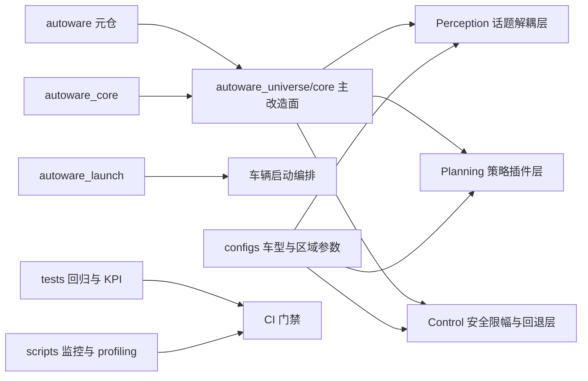

# howeverautoware

🔥 面向量产前工程化落地的 Autoware 主仓模板。  
🚀 以 `.repos` 为主入口，覆盖依赖管理、模块解耦、回归测试、CI、容器化、监控与实时性分析。  
⭐ 目标是把“能跑”升级为“可复现、可协作、可回归、可演进”的车端开发基线。

<p align="center">
  适配车型：SUV / MPV / Robotaxi ｜ 依赖主线：autoware + autoware_universe/core
</p>

<p align="center">
  
  
  
  
</p>

---

## 目录

- [1. 项目定位](#1-项目定位)
- [2. 目标车系与适用场景](#2-目标车系与适用场景)
- [3. 仓库结构与职责划分](#3-仓库结构与职责划分)
- [4. 架构总览](#4-架构总览)
- [5. 依赖管理策略（.repos 主入口）](#5-依赖管理策略repos-主入口)
- [6. 核心改造点（Perception / Planning / Control）](#6-核心改造点perception--planning--control)
- [7. 参数与配置分层](#7-参数与配置分层)
- [8. 测试与质量保障体系](#8-测试与质量保障体系)
- [9. 监控与实时性 Profiling](#9-监控与实时性-profiling)
- [10. 快速开始](#10-快速开始)
- [11. 开发规范（ROS2 包与依赖边界）](#11-开发规范ros2-包与依赖边界)
- [12. 上游同步与回归流程](#12-上游同步与回归流程)
- [13. 兼容矩阵（ROS2 发行版）](#13-兼容矩阵ros2-发行版)
- [14. 部署 SOP（仿真 / 实车）](#14-部署-sop仿真--实车)
- [15. 合规与许可证说明](#15-合规与许可证说明)
- [16. 分支、版本与 LTS 策略](#16-分支版本与-lts-策略)
- [17. 常见问题](#17-常见问题)
- [18. 30 条要求落地映射](#18-30-条要求落地映射)

---

## 1. 项目定位

这个仓库不是“单次演示工程”，而是面向团队协作的 Autoware 工程化骨架。

它要解决的核心问题是：

1. 依赖多仓、协作多角色，如何稳定复现同一环境。
2. 上游持续演进，如何在兼容前提下做车系定制。
3. 功能模块迭代快，如何避免接口破坏与隐性回归。
4. 从仿真到实车，如何形成可执行的统一流程与质量门禁。

本仓库以 `autoware` 元仓为认知入口，以 `autoware_universe/core` 作为核心改造关注面，同时把新增能力集中在 `my_modules/ros2_pkgs`，降低对上游主干的侵入。

---

## 2. 目标车系与适用场景

### 2.1 目标车系

- `SUV`：通勤与城市道路优先，平衡舒适性与稳定性。
- `MPV`：乘坐体验优先，控制策略强调平顺性。
- `Robotaxi`：高可用与安全冗余优先，强调回退策略与监控。

### 2.2 适用场景

- 课程/课题中台化搭建 Autoware 工程基线
- 小团队进行多车型参数治理与回归验证
- 上游跟踪 + 下游定制并行推进的项目形态

---

## 3. 仓库结构与职责划分

```text
.
├── autoware.repos                     # 上游基线依赖
├── my_vehicle.repos                   # 你的 fork 依赖组合
├── bootstrap_vehicle_stack.sh         # fork 检查与 repos 生成
├── my_modules/ros2_pkgs/              # 新增 ROS2 包（统一放这里）
├── configs/                           # 车型、标定、定位区域、QoS 配置
├── tests/                             # rosbag 回归与 KPI 规则
├── scripts/                           # 同步、回归、接口检查、监控与 profiling
├── docker/                            # 固定 ROS2 版本开发镜像
└── docs/                              # 架构、部署、兼容矩阵、合规文档
```

### 3.1 关键目录说明

| 目录 | 职责 | 原则 |
|---|---|---|
| `my_modules/ros2_pkgs/` | 自定义功能包 | 不直接破坏上游接口兼容 |
| `configs/vehicles/` | 分车型参数 | SUV/MPV/Robotaxi 独立维护 |
| `configs/calibration/` | 标定版本 | 只增不改，版本可追溯 |
| `configs/localization/` | 区域化定位参数 | 全局默认 + 区域覆盖 |
| `tests/` | 质量门禁 | 回归、KPI、预警可自动执行 |

---

## 4. 架构总览



设计思想：

1. 依赖层稳定：用 `.repos` 固定输入。
2. 能力层可扩展：用 topic 与 plugin 形成解耦。
3. 质量层可执行：回归脚本 + CI 一体化。

---

## 5. 依赖管理策略（.repos 主入口）

### 5.1 为什么坚持 `.repos`

- 统一依赖快照，团队复现简单。
- 区分“上游基线”和“我的组合”，减少认知混乱。
- 更适合多仓协作与持续同步上游。

### 5.2 当前依赖文件

- `autoware.repos`：官方上游基线
- `my_vehicle.repos`：`however-yir` fork 组合

### 5.3 一键准备 fork 与组合

```bash
./bootstrap_vehicle_stack.sh --owner however-yir
```

脚本会确保以下仓库存在并可用：

- `however-yir/autoware`
- `however-yir/autoware_universe`
- `however-yir/autoware_core`
- `however-yir/autoware_launch`

---

## 6. 核心改造点（Perception / Planning / Control）

### 6.1 Perception：话题接口解耦

包：`my_vehicle_perception_bridge`

- 通过 topic bridge 完成输入/输出映射。
- 避免上游模块与下游消费方直接耦合。
- 支持在不改业务链路的情况下切换传感器话题。

### 6.2 Planning：策略插件点

包：`my_vehicle_planning_strategies`

- 基于 `pluginlib` 定义策略扩展接口。
- 默认提供 `default_keep_lane` 示例策略。
- 便于按车型或场景注入不同规划策略。

### 6.3 Control：安全限幅 + fallback

包：`my_vehicle_control_safety`

- 对速度与角速度指令做限幅。
- 规划指令超时后自动进入回退命令。
- 保证失联/异常场景下控制行为可预期。

---

## 7. 参数与配置分层

### 7.1 分车型参数

目录：`configs/vehicles/{suv,mpv,robotaxi}/params.yaml`

每个车型维护独立参数，避免“大一统参数表”导致的隐性耦合与误配。

### 7.2 标定文件版本管理

目录：`configs/calibration/versions/`

原则：

1. 标定版本不可覆盖历史。
2. 每次变更建立新版本目录。
3. 元数据记录传感器序列号、地图、时间。

### 7.3 Localization 按区域分层

目录：`configs/localization/`

- `global_defaults.yaml`：全局默认
- `regions/*.yaml`：区域覆盖

适合同车系跨城市地图部署的差异化治理。

### 7.4 QoS 统一策略

- 策略文档：`docs/qos_policy.md`
- 默认配置：`configs/qos/default_qos.yaml`

---

## 8. 测试与质量保障体系

### 8.1 Rosbag 回放回归

- 脚本：`tests/rosbag_replay/run_rosbag_regression.sh`
- 目标：固定输入场景复验关键链路

### 8.2 端到端 KPI

- 规则：`tests/kpi/e2e_scenario_kpi.yaml`
- 示例指标：
  - 成功率
  - 横向舒适性（加速度）
  - 纵向舒适性（jerk）
  - 安全误触发率

### 8.3 接口破坏预警

- 脚本：`scripts/check_message_breaking_changes.sh`
- 监控对象：`msg/srv/action/idl` 变更
- 默认行为：阻断未审批的接口破坏

### 8.4 CI 基线

工作流：`.github/workflows/ci.yml`

包含：

1. `vcs import` 依赖导入
2. `colcon build`
3. `colcon test`
4. `ament lint`
5. 接口变更守卫
6. rosbag smoke 检查

---

## 9. 监控与实时性 Profiling

### 9.1 监控指标

脚本：`scripts/collect_topic_metrics.sh`

关注：

- topic 延迟（p50/p95/p99）
- 丢包率
- QoS 不匹配观察

### 9.2 实时性分析

脚本：`scripts/profile_realtime.sh`

关注：

- 回调延迟
- deadline miss 数量
- 调度抖动

这两类输出会沉淀在 `reports/`，用于版本对比与发布评审。

---

## 10. 快速开始

### 10.1 环境要求

- Ubuntu 22.04（推荐）
- ROS2 Humble
- `python3-vcstool`
- `colcon`
- `git` / `gh`

### 10.2 拉取依赖

```bash
mkdir -p src
vcs import src < my_vehicle.repos
```

### 10.3 构建与测试

```bash
source /opt/ros/humble/setup.bash
colcon build --symlink-install
source install/setup.bash
colcon test
colcon test-result --verbose
```

### 10.4 上游合并后的一键全回归

```bash
./scripts/post_upstream_merge.sh
```

---

## 11. 开发规范（ROS2 包与依赖边界）

### 11.1 包命名规范

- 使用 ROS2 推荐命名：`lowercase_with_underscores`
- 新增包统一放入：`my_modules/ros2_pkgs/*`

### 11.2 `package.xml` 依赖边界

- 只声明必要依赖，不做“全量兜底依赖”
- 测试依赖与运行依赖分开维护

### 11.3 `CMakeLists.txt` 最小依赖链接

- 保持最小 `find_package` 集合
- 避免无关库链入导致构建慢与耦合扩大

---

## 12. 上游同步与回归流程

### 12.1 同步上游远端

```bash
./scripts/sync_upstreams.sh
```

### 12.2 合并后回归

```bash
./scripts/run_full_regression.sh
```

### 12.3 强制原则

每次 upstream 合并后，必须执行完整回归再推进发布分支。

---

## 13. 兼容矩阵（ROS2 发行版）

详细见：`docs/compatibility_matrix.md`

当前建议：

| 发行版 | 状态 | 说明 |
|---|---|---|
| Humble | 主线 LTS | 当前默认与优先支持 |
| Iron | 观察 | 仅按需回补 |
| Jazzy | 规划中 | 待上游稳定后评估 |

---

## 14. 部署 SOP（仿真 / 实车）

详细见：`docs/deployment_sop.md`

- 仿真：偏重功能链路与回归效率
- 实车：偏重标定一致性、区域参数匹配、安全策略校验

发布前建议最少经过：

1. 仿真回归通过
2. rosbag 回放通过
3. KPI 达标
4. 实时性报告无明显退化

---

## 15. 合规与许可证说明

- 仓库许可证：`Apache-2.0`
- 合规清单：`docs/COMPLIANCE_CHECKLIST.md`
- 第三方说明：`docs/THIRD_PARTY_NOTICES.md`

同时要求：

1. 保留上游 `LICENSE/NOTICE`。
2. 变更文件标注来源与日期。
3. 发布前完成合规检查门。

---

## 16. 分支、版本与 LTS 策略

- 开发分支：`codex/autoware-30point-foundation`
- LTS 标签格式：`lts-autoware-YYYYMMDD`
- 当前已创建示例标签：`lts-autoware-20260407`

建议流程：

1. 功能分支开发
2. 回归通过后合并到稳定分支
3. 打 LTS 标签沉淀可回溯快照

---

## 17. 常见问题

### Q1：为什么不把所有改动直接放在上游仓库里？

为了降低升级冲突与长期维护成本。新增能力集中在 `my_modules/ros2_pkgs`，更利于上游跟踪。

### Q2：接口改动一定会被 CI 拦截吗？

涉及 `msg/srv/action/idl` 变更会触发守卫。若为受控变更，需要先补 `docs/interface_changes/` 说明再放行。

### Q3：如果没有 rosbag 数据还能跑 CI 吗？

默认可跑 smoke。你也可以设置强制模式（例如 `REQUIRE_ROSBAG=1`）来开启严格门禁。

### Q4：什么时候更新兼容矩阵？

建议按季度评审，或在 ROS2 主线升级、上游重大变更后即时更新。

---

## 18. 30 条要求落地映射

| 需求方向 | 当前落点 |
|---|---|
| `autoware` 元仓认知、核心在 `autoware_universe/core` | README 架构与依赖策略章节 + `docs/architecture.md` |
| fork `autoware_universe/core/launch` 并用 `.repos` 管理 | `bootstrap_vehicle_stack.sh` + `my_vehicle.repos` |
| 新增包位置与命名规范 | `my_modules/ros2_pkgs/*` |
| 依赖边界与最小链接 | 各包 `package.xml` / `CMakeLists.txt` |
| 车型、标定、区域化参数 | `configs/vehicles` / `configs/calibration` / `configs/localization` |
| perception 解耦、planning 插件、control 安全 | 三个自定义 ROS2 包 |
| QoS 文档化 | `docs/qos_policy.md` + `configs/qos/default_qos.yaml` |
| rosbag 回归、KPI、接口预警 | `tests/rosbag_replay` / `tests/kpi` / `scripts/check_message_breaking_changes.sh` |
| CI + 容器 + 监控 + profiling | `.github/workflows/ci.yml` + `docker/` + `scripts/*metrics*` + `scripts/profile_realtime.sh` |
| 架构文档、部署 SOP、兼容矩阵、LTS | `docs/architecture.md` / `docs/deployment_sop.md` / `docs/compatibility_matrix.md` / 标签策略 |
